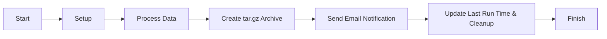

# Evergreen LibraryIQ Export

This software extracts data from an Evergreen server and securely transfers the output to a specified SFTP server. It also sends an email notification upon completion, indicating success or failure. The output data is stored locally in a specified archive folder.


## Features

- **Modular Design**: The script is divided into multiple modules for better maintainability and readability.
- **Chunking Data**: Large queries are processed in chunks to prevent memory consumption and timeouts.
- **Email Notifications**: Notifies staff of success or failure, including logs or summaries.
- **SFTP Transfer**: Securely uploads results to a remote server.
- **Logging**: Verbose logging to track the execution process and any errors.
- **History Tracking**: Stores the last run time to determine whether to run a partial (incremental) or full extract.

## Directory Structure

```
📁 archive/
    ├── 📄 .gitkeep
📁 config/
    └── ⚙️ library_config.conf.example
📁 lib/
    ├── 🐪 DBUtils.pm
    ├── 🐪 Email.pm
    ├── 🐪 Logging.pm   
    ├── 🐪 Queries.pm
    ├── 🐪 SFTP.pm
    └── 🐪 Utils.pm
📁 tmp/
    ├── 📄 .gitkeep
📄 .gitignore
🐪 extract_libraryiq.pl
📄 README.md
```

## Installation

1. Clone the repository:
    ```bash
    git clone https://github.com/IanSkelskey/library-iq-extract.git
    cd libraryiq-extract
    ```

2. Copy the example configuration file and edit it to match your environment:
    ```bash
    cp config/library_config.conf.example config/library_config.conf
    vi config/library_config.conf
    ```

3. Install the required Perl modules:
    ```bash
    cpan install DBI DBD::Pg Net::SFTP::Foreign Email::MIME Email::Sender::Simple
    ```

## Configuration

Edit the `config/library_config.conf` file to set the appropriate values for your environment. Key configuration options include:

| Configuration Option | Description                                                   |
| -------------------- | ------------------------------------------------------------- |
| `logfile`            | Path to the log file.                                         |
| `tempdir`            | Temporary directory for storing intermediate files.           |
| `archive`            | Directory for storing archived files.                         |
| `librarynames`       | Comma-separated list of branch/system shortnames.             |
| `chunksize`          | Number of records to process per chunk.                       |
| `ftphost`            | SFTP server hostname.                                         |
| `ftplogin`           | SFTP server login username.                                   |
| `ftppass`            | SFTP server login password.                                   |
| `remote_directory`   | Directory on the SFTP server where files will be uploaded.    |
| `alwaysemail`        | Always send email notifications, even if there are no errors. |
| `fromemail`          | Email address from which notifications will be sent.          |
| `erroremaillist`     | Comma-separated list of email addresses to notify on error.   |
| `successemaillist`   | Comma-separated list of email addresses to notify on success. |

## Usage

Make sure the script has execute permissions:

```bash
chmod +x extract_libraryiq.pl
```

Run the script with the desired options:

```bash
./extract_libraryiq.pl --config config/library_config.conf
```

Run the script without any network operations (email, SFTP):

```bash
./extract_libraryiq.pl --config config/library_config.conf --no-email --no-sftp
```

### Command Line Options

| Option           | Description                                                    |
| ---------------- | -------------------------------------------------------------- |
| `--config`       | Path to the configuration file (default: library_config.conf). |
| `--debug`        | Enable debug mode for more verbose output.                     |
| `--full`         | Perform a full dataset extraction.                             |
| `--no-email`     | Disable email notifications.                                   |
| `--no-sftp`      | Disable SFTP file transfer.                                    |
| `--drop-history` | Drop and recreate the libraryiq schema before running.         |

## Perl Modules

| Module         | Description                                                                                        |
| -------------- | -------------------------------------------------------------------------------------------------- |
| **DB.pm**      | Handles database connections and chunked queries.                                                  |
| **Email.pm**   | Handles email notifications.                                                                       |
| **Logging.pm** | Handles logging with timestamps.                                                                   |
| **Queries.pm** | Contains SQL queries for fetching data.                                                            |
| **SFTP.pm**    | Handles SFTP file transfers.                                                                       |
| **Utils.pm**   | Contains utility functions for reading configuration, tracking history, and processing data types. |

## Process Flow



## Setting Up Cron Jobs

To automate the extraction process, you can set up cron jobs to run the script at specified intervals. For example, you can run a full extract once per month and an incremental extract nightly.

1. Open the crontab file for editing:
    ```bash
    crontab -e
    ```

2. Add the following lines to schedule the full extract to run at 2 AM on the first day of every month and the incremental extract to run at 2 AM every night:

    ```bash
    # Full extract on the first day of every month at 2 AM
    0 2 1 * * /path/to/extract_libraryiq.pl --config /path/to/config/library_config.conf --full

    # Incremental extract every night at 2 AM
    0 2 * * * /path/to/extract_libraryiq.pl --config /path/to/config/library_config.conf
    ```

    Replace `/path/to/extract_libraryiq.pl` and `/path/to/config/library_config.conf` with the actual paths to your script and configuration file.

3. Save and close the crontab file.

These cron jobs will ensure that the full extract runs once a month and the incremental extract runs nightly, automating the data extraction process.
